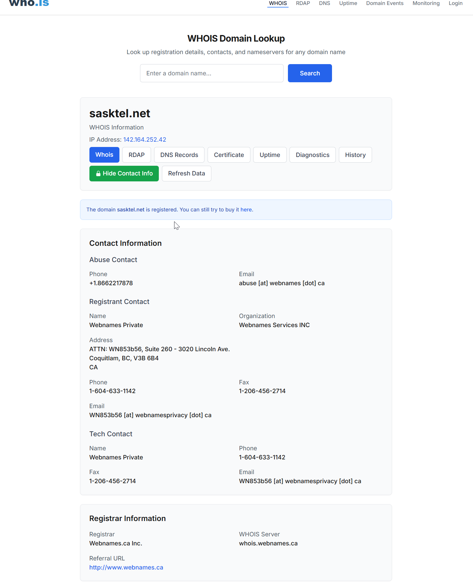
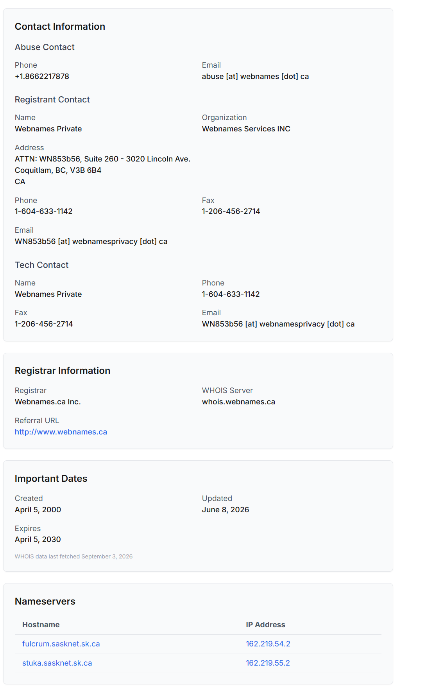
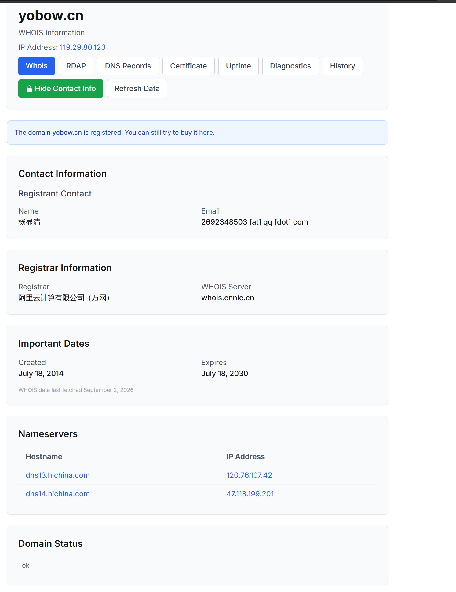
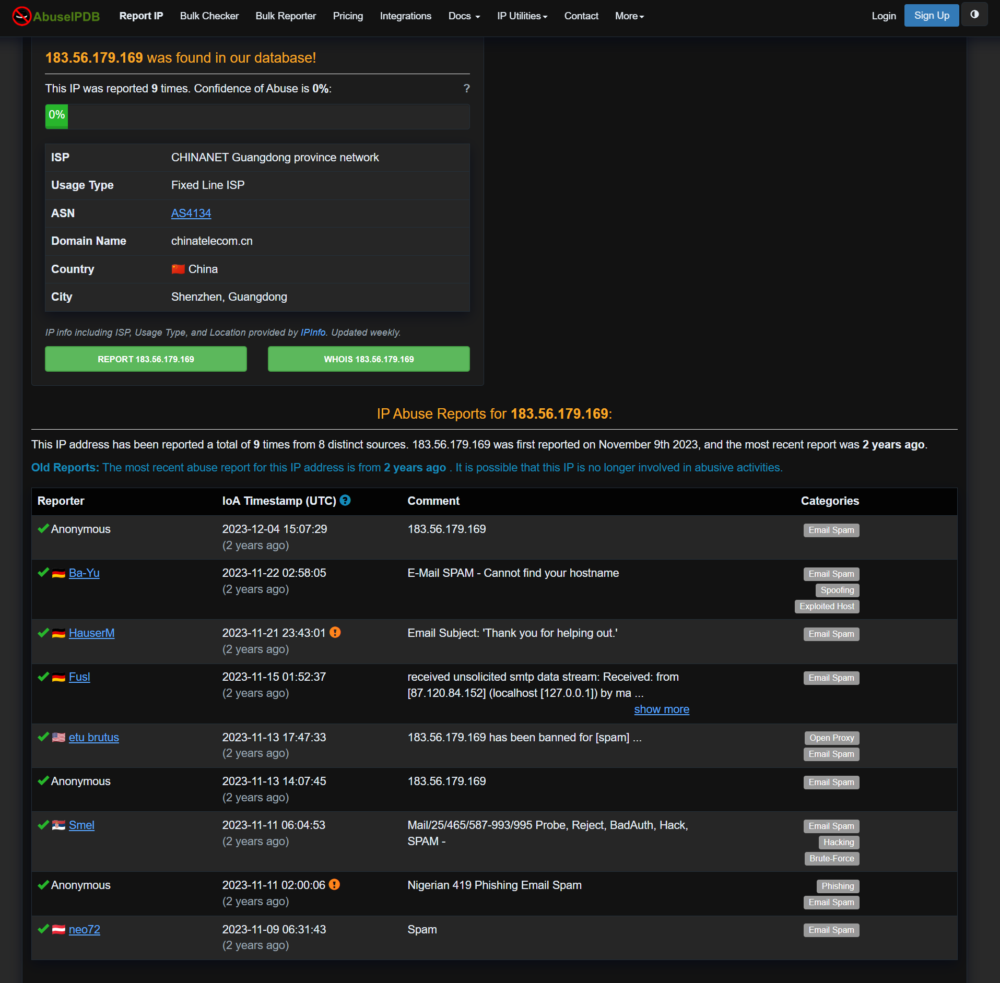
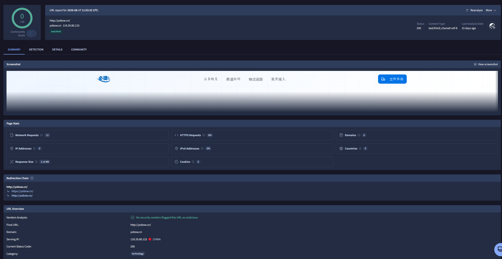
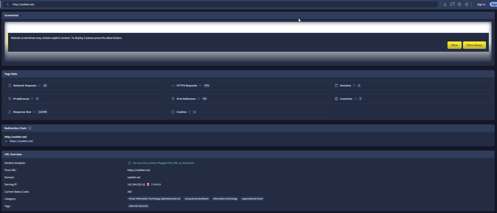
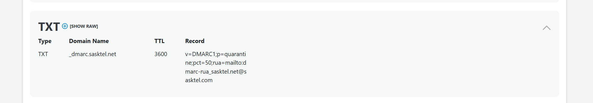
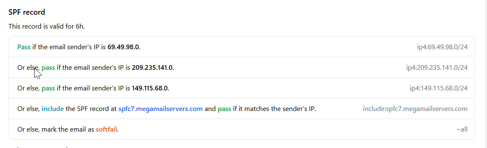
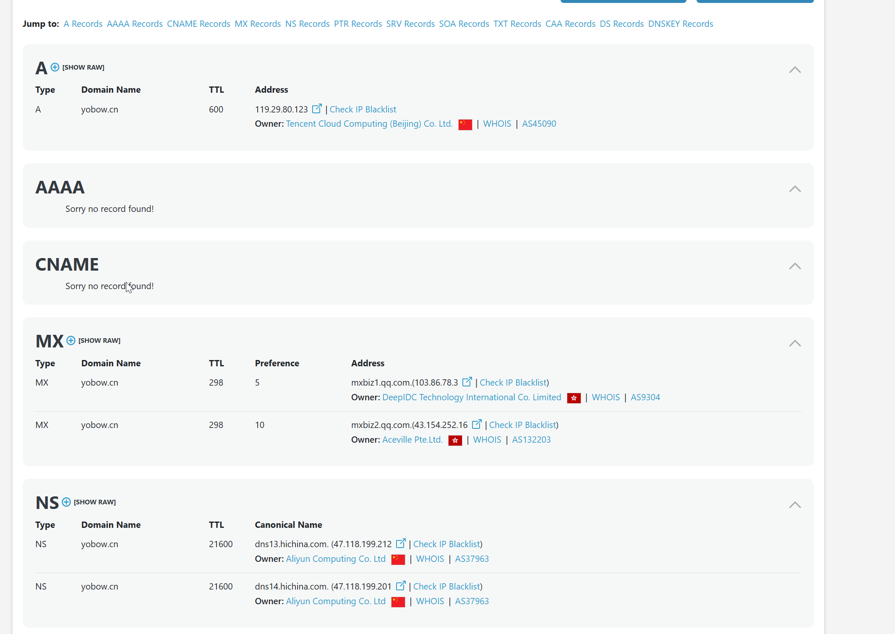
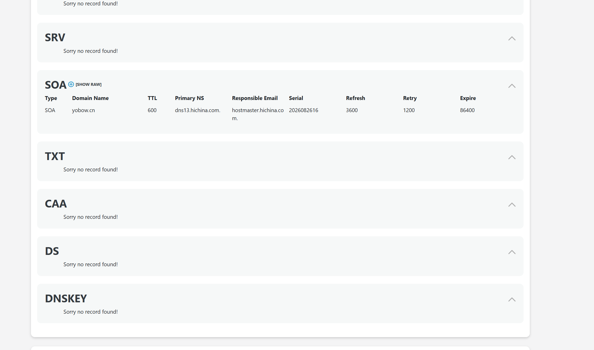

# Impersonated US Treasury Officials — Advance-Fee Fraud Email

## 🎬 Scenario:

MyDFIR "First Email Analysis" lab: examine a raw email's technical details without opening it in a mail client,
and use OSINT to extract additional context. The exercise provides a password-protected archive
(`First_Email.zip`) containing `First_Email.eml`, to be inspected in a plain text editor.

## 🧩 Context

Role: raw header and OSINT analysis, no SIEM/log pipeline involved for this exercise.

**Tools:** PowerShell (`Get-FileHash`), Notepad++ (raw header/body inspection), DNSChecker, who.is, AbuseIPDB,
VirusTotal

**Timezone note:** sources mix time zones — the email's own `Date` header is `-0800`, the Microsoft-side
`Received` chain is UTC, and the final relay hop is `+0800 (CST)`. Each timestamp in this report keeps its
original zone rather than being normalized, to avoid introducing a conversion error.

**Incident Date:** 2023-12-06

**Artifact:**

| File | Verification |
| --- | --- |
| `First_Email.zip` | SHA256 `D54BD8569C47350BB77D0179E557BD89A030A27E7F0CDA4C7C6943E9A3CEDCEB`, matches lab statement |
| `First_Email.eml` (extracted) | SHA256 `D7942B86529946BFF77914A0569C1C8EE31F6DC3AA647289747CDAE21638DDB0`, matches lab statement (`Get-FileHash`) |

## 📋 Investigation Summary

The email (`Message-ID: 20231206125957.6414E20EB5FD@mail.yobow.cn`) is an advance-fee ("419-style") fraud
impersonating a fictitious US federal authority ("United States Funds Authority") and real public officials
(Treasury Secretary Janet Yellen, Treasurer Lynn Malerba) to announce a fabricated $16,000,000 transfer,
conditioned on the recipient contacting one of two "diplomatic agents."

Header analysis shows an authentication failure consistent with domain spoofing: SPF `softfail` — the sending
IP `183.56.179.169` matches none of the ranges authorized by `sasktel.net`'s real SPF record:

```
v=spf1 ip4:69.49.98.0/24 ip4:209.235.141.0/24 ip4:149.115.68.0/24 include:spfc7.megamailservers.com ~all
```

DKIM is absent and DMARC is not enforced. The full `Received` chain — reconstructed from the recipient's Microsoft
Exchange Online Protection headers — shows the last external hop before Microsoft's own infrastructure is
`183.56.179.169`, announcing itself as `mail.yobow.cn`. That hostname has no corroborating DNS evidence (see
Uncertainties in Reputation Analysis) — `183.56.179.169` is the only independently verified artifact.

No attachment (`Content-Type: text/html`, single top-level type, no `multipart` structure) and no embedded
hyperlinks — plain-text email addresses are the only engagement vector, with a `Reply-To` diverging from the
`From` address and two named "agents" in the body. The `To: Undisclosed recipients:` field confirms mass BCC
delivery, consistent with a campaign rather than individual targeting.

## ⭕ Scoping

Organizational-level scoping (who else received this email, who replied, who clicked or downloaded) was
deliberately out of scope for this exercise — this is a mass-campaign lab artifact with no real organizational
context or evidence of user interaction to scope. This is a scoping boundary, not a gap.

The response criteria below were defined as a generalizable reflex for handling an equivalent case in a real
environment — hypothetical, not verified against this specific incident.

## 🚧 Criticality, Impact, and Response

No remediation was required for this lab exercise (no real system affected). The following graduated response
criteria were defined for an equivalent case in a real environment:

- **First occurrence of this sender/pattern**: block the sender, quarantine associated emails (same relay IP
  and/or same contact addresses named in the body).
- **User replied** (no click, no shared credentials): reach out to the user for context and awareness, block
  the sender.
- **User clicked a link or shared credentials** (not applicable to this specific email — no link present;
  generic criterion for the wider case family): treat as a full incident — account lockout, password reset,
  active session invalidation.

## ⛓️ CyberKillChain: IOA/IOC

**Methodological note**: this email carries no attachment and no link — no technical payload-delivery
mechanism (no Exploitation/Installation/C2 in the classic sense). The mapping below is inherently partial by
nature of the case, not by investigation gap.

| IOA (Behavior) | Kill Chain Phase | MITRE Technique | IOC (Artifact) |
|---|---|---|---|
| Mass delivery, recipients hidden (BCC) | Delivery | *(no applicable technical delivery technique)* | `To: Undisclosed recipients:` |
| Impersonation of real public officials (Janet Yellen, Lynn Malerba) and a fictitious authority, using urgency and a promised transfer to compel a reply | Delivery | **T1684.001 — Social Engineering: Impersonation** | Email body, "United States Funds Authority" signature |
| Sending-domain spoofing (`sasktel.net` not authorized for the sending IP) as the technical vehicle for the impersonation above | Delivery | **T1684.001 — Social Engineering: Impersonation** | `spf=softfail`, `dkim=none`, `dmarc=none` (Authentication-Results) |
| SMTP relay via a third-party IP with no DNS link to the impersonated/claimed domain | Delivery | *(no dedicated technique identified)* | `183.56.179.169` (CHINANET Guangdong, no PTR) |
| Solicitation of a reply to extract further engagement/personal information, rather than delivering a technical payload | Reconnaissance (attacker-side) | **T1598 — Phishing for Information** | Email body |

*IDs verified against attack.mitre.org on 2026-09-03: **T1684.001** (Social Engineering: Impersonation, tactic
Stealth/TA0005 — confirms the v19.1 Defense Evasion split noted in `investigation_principles.md`) and **T1598**
(Phishing for Information, tactic Reconnaissance/TA0043, current). No dedicated technique exists for a
third-party relay with an unverified hostname claim — left unmapped rather than forced onto an ill-fitting ID.*

## 🕒 Timeline

- Domain registration history
  - 2000-04-05: `sasktel.net` (impersonated legitimate domain) registered — Webnames.ca Inc., Canada
    
    
  - 2014-07-18: `yobow.cn` (domain named in the relay's self-declared hostname) registered — Alibaba Cloud
    (万网), China
    
- Sender IP reputation window
  - 2023-11-09 → 2023-12-04: 9 spam reports on AbuseIPDB for `183.56.179.169`, including one explicitly
    categorized "Nigerian 419 Phishing Email Spam" (2023-11-11) — directly bracketing this email's send date
    
- Delivery
  - 2023-12-06, 17:07:14 UTC: message received by the recipient's Microsoft Exchange Online Protection gateway
    (`DM6NAM04FT068.mail.protection.outlook.com`) from `183.56.179.169`, announcing itself as `mail.yobow.cn`
  - 2023-12-06, 17:07:14 → 17:07:20 UTC: internal transit across 5 Microsoft Exchange Online/Outlook hops to
    inbox delivery
  - 2023-12-06, 05:00:12 -0800 (`Date` header): timestamp declared by the sender

## 🔎 Reputation Analysis

### Infrastructure Reputation

#### AbuseIPDB — `183.56.179.169`


- Reported 9 times by 8 distinct sources, confidence of abuse 0% (AbuseIPDB's own scoring method — not to be
  read as low risk given the categories below)
- ISP: CHINANET Guangdong province network — Usage Type: Fixed Line ISP — ASN AS4134 — China, Shenzhen
- Categories: Email Spam (majority), Spoofing, Exploited Host, Open Proxy (unverified user-submitted category),
  Hacking/Brute-Force, and one explicit "Nigerian 419 Phishing Email Spam" report (2023-11-11)
- No PTR record resolves for this IP
- **Bonus question (VPN)**: Usage Type "Fixed Line ISP" (not "Data Center/Web Hosting/Transit") argues against
  a commercial VPN — no dedicated VPN-detection tool (IPQualityScore/Scamalytics) was run; this conclusion
  rests on indirect indicators only

#### VirusTotal — `yobow.cn`



- Community score 0/92 — **checked at analysis time (2026), which has no bearing on the domain's state back in
  2023**; the site currently served at this address is an unrelated Chinese business site (category
  "technology")
- Does not answer, by construction, whether the domain's mail infrastructure had a phishing history in 2023

#### VirusTotal — `sasktel.net`



- Community score 0/92, serving IP `142.164.252.42` (Canada), categorized "Email, Information Technology",
  "organizational email" — consistent with a legitimate domain that was itself impersonated, not the attacker's
  own infrastructure

### Domain Reputation

#### WHOIS — `sasktel.net`


- Created 2000-04-05, updated 2026-06-08, expires 2030-04-05 — registrar Webnames.ca Inc.
- Nameservers `fulcrum.sasknet.sk.ca` / `stuka.sasknet.sk.ca`
- Legitimate SPF published — does not include `183.56.179.169`:

  ```
  v=spf1 ip4:69.49.98.0/24 ip4:209.235.141.0/24 ip4:149.115.68.0/24 include:spfc7.megamailservers.com ~all
  ```

  
  

- DMARC published (`_dmarc.sasktel.net`): `v=DMARC1;p=quarantine;pct=50;rua=mailto:dmarc-rua_sasktel.net@sasktel.com`
- No DKIM record found (`_dkim`/`selector._domainkey`) — consistent with this message's own `dkim=none`

#### WHOIS/DNS — `yobow.cn`




- Created 2014-07-18 (~9 years old at send time), expires 2030-07-18 — registrant 杨显清 (individual),
  registrar Alibaba Cloud (万网)
- A record → `119.29.80.123` (Tencent Cloud, Beijing)
- MX → `mxbiz1/2.qq.com` (Tencent QQ Mail)
- No SRV/TXT/CAA/DS/DNSKEY records — `yobow.cn` has no SPF/DMARC of its own, unlike `sasktel.net`

  

- **None of these records correspond to `183.56.179.169`** — see uncertainty below

**Uncertainty carried forward from the audit**: the link between `mail.yobow.cn` (the hostname the relay
announced) and `183.56.179.169` (the IP actually seen by the recipient's gateway) is not corroborated by any
independent DNS evidence (no matching A/MX record, no PTR). It is recorded as observed by Microsoft's own
receiving infrastructure, which makes it more reliable than a self-declared client-side header — but it does
not establish that the domain `yobow.cn` (Tencent-hosted, unrelated MX) is itself the operator of the sending
infrastructure. `183.56.179.169` alone is the verified artifact.

## 🪞 Continuous improvement

### Impersonation Pattern Detection

This email impersonated named public officials (Janet Yellen, Lynn Malerba) alongside a fabricated authority
and a large promised transfer. Build a detection rule pattern-matching high-profile official/organization names
combined with financial-transfer language in inbound mail bodies, rather than relying solely on
sender-reputation checks.

### SPF Softfail + Reply-To Mismatch Correlation

`sasktel.net` is a legitimate, otherwise reputable domain with a real SPF/DMARC policy — the spoofing was only
visible through the `softfail` result plus a `Reply-To` diverging from `From`. Correlate SPF softfail/fail
results with a `Reply-To` ≠ `From` mismatch to catch spoofing of real third-party domains, not just obviously
disposable ones.

### Full Received-Chain Verification Before Attribution

This hunt's own audit caught an early attribution error: the last-captured `Received` header alone was treated
as sufficient to identify the sending infrastructure. Only reconstructing the full chain (all Microsoft
Exchange Online Protection hops back to the external relay) revealed that the claimed hostname (`mail.yobow.cn`)
has no DNS corroboration, and that the verified artifact is the IP alone. Standing reflex for future hunts:
always pull the complete `Received` chain before attributing infrastructure, not just the first header captured.
