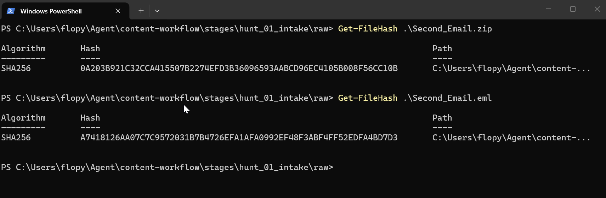
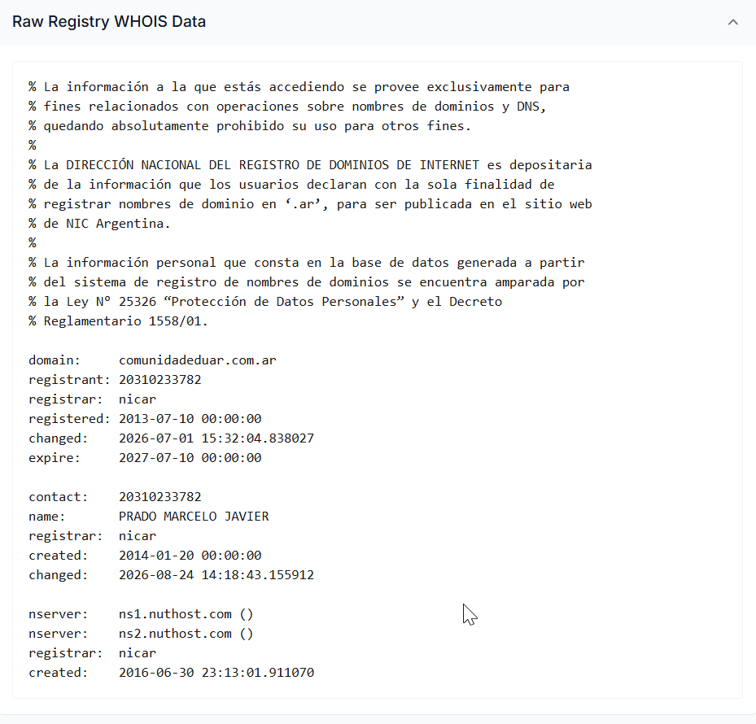
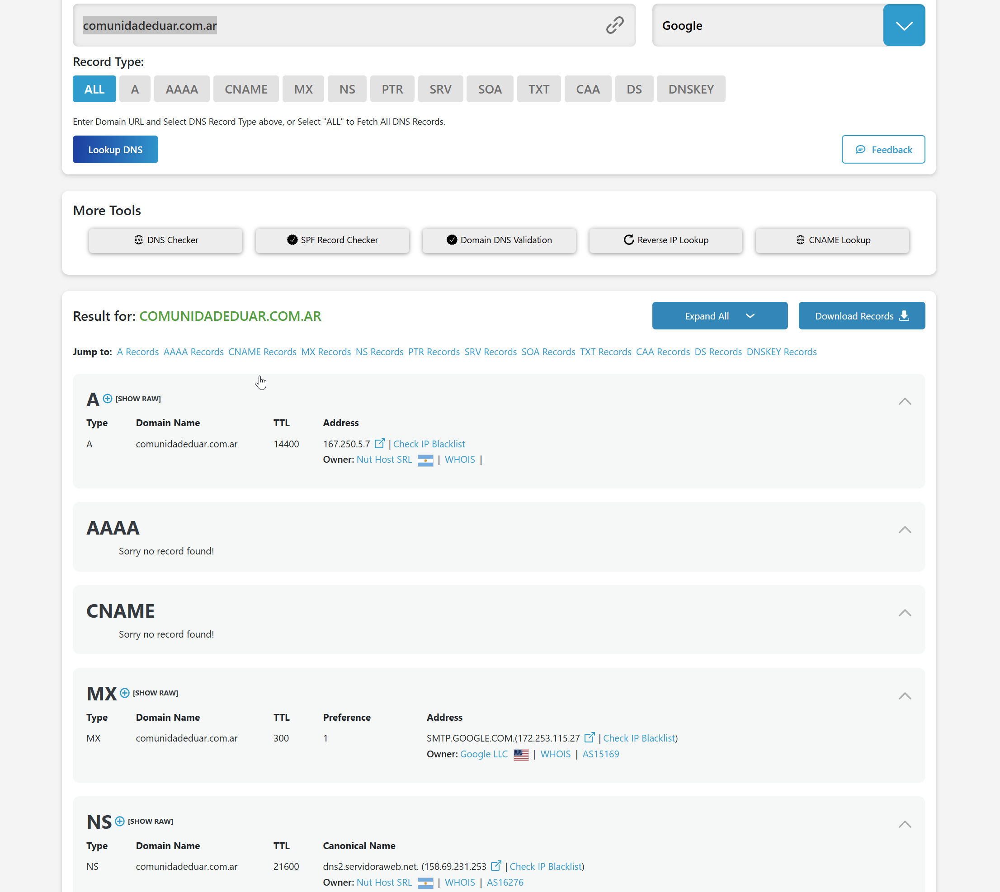
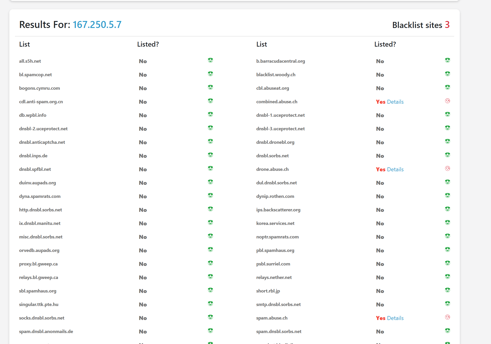
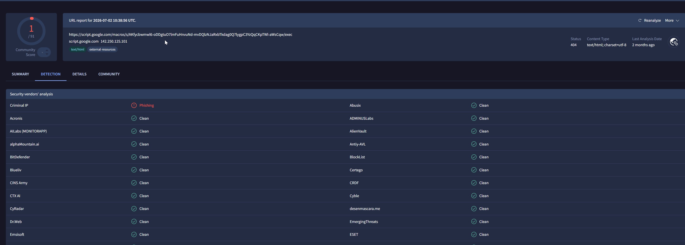
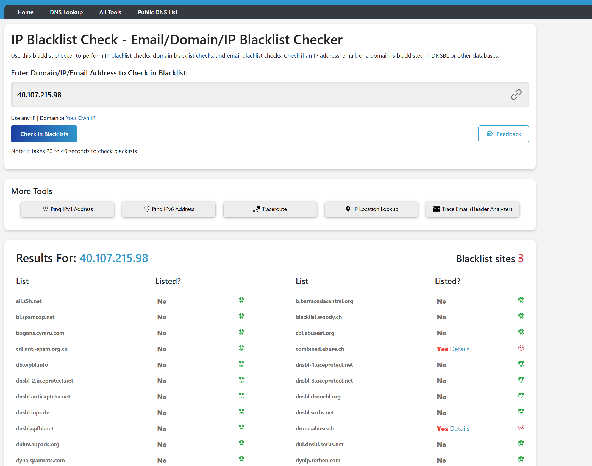
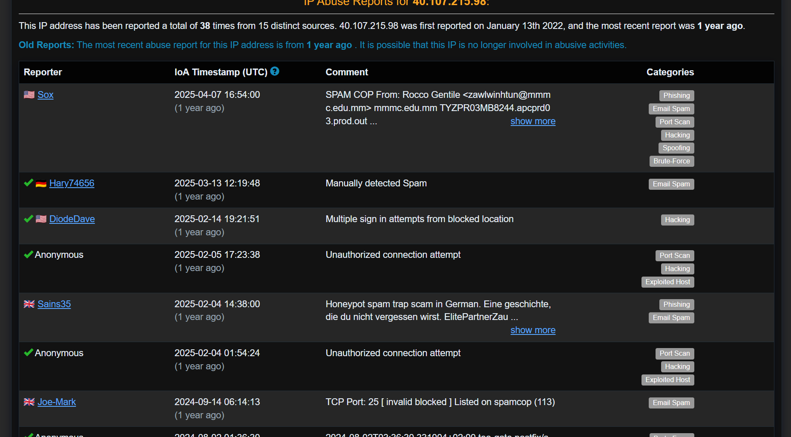
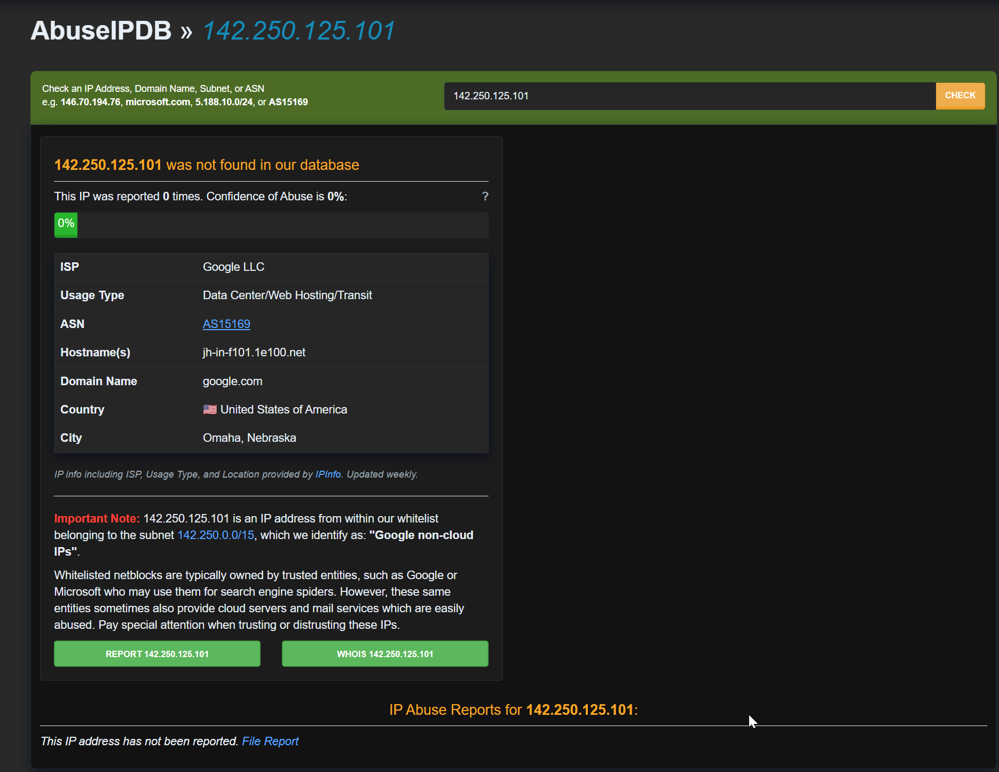

# Impersonated Amazon Support — Account-Lock Phishing via a Likely-Compromised M365 Tenant

**Published:** 2026-09-10

## 🎬 Scenario:

Personal phishing email received on 8 September 2023, impersonating Amazon and claiming the recipient's account
was put on hold due to a billing-information mismatch, pressuring the recipient to "update their information"
within 24 hours or have the account deleted. Provided as a password-protected archive (`Second_Email.zip`)
containing `Second_Email.eml`, with two reference SHA256 hashes supplied alongside the archive.

## 🧩 Context

Role: raw header and OSINT analysis, no SIEM/log pipeline involved — self-directed investigation, not a
community lab exercise.

**Tools:** PowerShell (`Get-FileHash`), Notepad++ (raw header/body inspection), DNSChecker, who.is, VirusTotal,
AbuseIPDB, urlscan.io, Cloudflare Radar, Wayback Machine.

**Timezone note:** the email's own `Date` header is `+0500`; the Microsoft Exchange Online Protection `Received`
chain is UTC. Each timestamp below keeps its original zone rather than being normalized, to avoid introducing a
conversion error.

**Incident Date:** 2023-09-08

**Artifact:**

| File | Verification |
| --- | --- |
| `Second_Email.zip` | SHA256 `0A203B921C32CCA415507B2274EFD3B36096593AABCD96EC4105B008F56CC10B`, matches reference hash |
| `Second_Email.eml` (extracted) | SHA256 `A7418126AA07C7C9572031B7B4726EFA1AFA0992EF48F3ABF4FF52EDFA4BD7D3`, matches reference hash |



Full raw content (headers + MIME body) reproduced in [`raw-email.md`](raw-email.md).

## 📋 Investigation Summary

The email (`Message-ID: lCoLrriMV1genj0ZtZQMKEVTBnhfL56Wal3quBo1vU@mail-pf1-f856.outlook.office365.com`)
impersonates Amazon, claiming a billing-information mismatch and pressuring the recipient with a 24-hour
deletion threat. SPF, DKIM, and DMARC all `pass` for the declared sending domain `comunidadeduar.com.ar` — this
confirms the message is authenticated as originating from that domain, it does not by itself establish that the
domain or its operator are trustworthy.

```
ARC-Authentication-Results: i=2; mx.microsoft.com 1; spf=pass (sender ip is
 40.107.215.98) smtp.rcpttodomain=hotmail.com
 smtp.mailfrom=comunidadeduar.com.ar; dmarc=bestguesspass action=none
 header.from=comunidadeduar.com.ar; dkim=none (message not signed); arc=pass
 (0 oda=1 ltdi=1 spf=[1,1,smtp.mailfrom=comunidadeduar.com.ar]
 dkim=[1,1,header.d=comunidadeduar.com.ar]
 dmarc=[1,1,header.from=comunidadeduar.com.ar])
```

Reconstructing the full `Received` chain (rather than relying on the header nearest the final inbox) shows
several hops internal to the recipient's own Microsoft 365 tenant before reaching the true external boundary:
`APC01-SG2-obe.outbound.protection.outlook.com (40.107.215.98)`, delivering to
`VI1EUR05FT018.mail.protection.outlook.com`. The hostname identifies `40.107.215.98` as Microsoft's own shared
Exchange Online Protection outbound relay pool, used by all Microsoft 365 tenants — not infrastructure dedicated
to the sender. There is no dedicated "attacker IP" to attribute in this delivery chain; the only meaningful
attribution anchor is the sending domain/tenant itself.

```
Received: from APC01-SG2-obe.outbound.protection.outlook.com (40.107.215.98)
 by VI1EUR05FT018.mail.protection.outlook.com (10.233.243.101) ...
```

OSINT on `comunidadeduar.com.ar` identifies "Comunidad Educativa.ar", an Argentine school-management platform
with named, active subdomains (`enes.comunidadeduar.com.ar`, `enape.comunidadeduar.com.ar`) tied to Escuela
Nacional Ernesto Sabato and UNICEN (a public Argentine university), copyright-dated 2016–2026, and a Wayback
Machine snapshot returning HTTP 200 as recently as 2025-03-19. This points to a real, actively maintained
educational tenant likely compromised to send this message, rather than a domain purpose-built as a cover
identity — treated as a probability, not an established fact (see Uncertainties).

The message body carries a duplicated MIME structure: a primary `text/html` part and a second part declared
`Content-Type: text/html` but named and dispositioned as an attachment (`Detailsdisable-262340.pdf`).

```
Content-Type: multipart/mixed; boundary="NextPart_1_LCOLRRIMV1GENJ0ZTZQMKEVTBNHFL56WAL3QUBO1VU"
Content-Transfer-Encoding: 8bit

Content-Type: text/html; charset=##custom6##
Content-Transfer-Encoding: 8bit

Content-Type: text/html; name=Detailsdisable-262340.pdf
Content-Transfer-Encoding: base64
Content-Disposition: attachment; filename=Detailsdisable-262340.pdf
```

Base64 decoding confirms HTML content (no `%PDF-` signature), reproducing the same phishing page as the primary
body, with unresolved template placeholders (`##email##`, `##date##`, `##device##`) in both — consistent with a
generic phishing kit whose attachment-fallback template was never properly populated. The embedded link
(`https://script.google.com/macros/s/AKfycbwmwl6-oDDgtuO7lmFuHnvuNd-mvDQlzNJaRxbTkdag0Q7lygpC3YzQqCKpTWl-aWsCqw/exec`)
appears identically in both parts, points to a Google Apps Script endpoint rather than any Amazon domain, and
returned HTTP 404 at scan time — the hypothesis that it served a credential-harvesting form is plausible but
unconfirmed.

The `From` display name, `"noreply@Quick Response"`, mimics the visual pattern of a legitimate automated
`noreply@` sender while most mail clients never surface the real address
(`nuthostsrl.SaintU74045Walker@comunidadeduar.com.ar`) unless the recipient explicitly inspects it — the same
surface-plausibility-vs-technical-reality pattern as the fake PDF attachment.

```
From: "noreply@Quick Response" <nuthostsrl.SaintU74045Walker@comunidadeduar.com.ar>
Reply-To: N/A
Return-Path: nuthostsrl.SaintU74045Walker@comunidadeduar.com.ar
Subject: We locked your account for security reason - Fri, September 08, 2023  10:11 AM
```

## ⭕ Scoping

The recipient mailbox is an individual `hotmail.com` account (`smtp.rcpttodomain=hotmail.com`, confirmed via
`ARC-Authentication-Results`), not an organizational context — no scoping for other recipients was warranted.

Lateral movement, credential access, and persistence on the likely-compromised hosting infrastructure
(`comunidadeduar.com.ar`'s own M365 tenant) are explicitly out of scope: no telemetry is available from the
position of an external recipient. This is a scoping boundary imposed by data access, not a gap.

The response criteria below were defined as a generalizable reflex for handling an equivalent case in a real
organizational environment — hypothetical, not verified against this specific incident.

## 🚧 Criticality, Impact, and Response

No remediation was required for this individual case beyond deleting/reporting the message. The following
graduated response criteria were defined for an equivalent case in a real environment:

- **First occurrence of this sender/pattern**: block the sender, quarantine associated emails (same domain
  and/or same embedded URL).
- **Search by subject** across the mail environment to identify other recipients of the same campaign.
- **User clicked the link**: treat as a credential-exposure incident — reset password and revoke active
  sessions (e.g., Entra ID) for the affected account, regardless of whether credential submission on the linked
  form can be directly confirmed.
- **Outbound network check**: search proxy/firewall logs for connections to `script.google[.]com` URLs
  containing `exec` around the incident window, to identify who reached the endpoint.

## ⛓️ CyberKillChain: IOA/IOC

| IOA (Behavior) | Kill Chain Phase | MITRE Technique | IOC (Artifact) |
|---|---|---|---|
| Phishing email impersonating Amazon, urging the recipient to click an external link | Delivery | **T1566.002 — Phishing: Spearphishing Link** | URL `script.google.com/macros/s/.../exec` |
| Display name mimicking a legitimate automated `noreply@` sender while masking the real address | Delivery | **T1684.001 — Social Engineering: Impersonation** | `From: "noreply@Quick Response" <nuthostsrl.SaintU74045Walker@comunidadeduar.com.ar>` |
| Fake `.pdf` attachment whose declared Content-Type and decoded content are HTML, duplicating the phishing content | Delivery | **T1036.008 — Masquerading: Masquerade File Type** | `Content-Type: text/html; name=Detailsdisable-262340.pdf` |
| Delivery via a likely-compromised legitimate M365 tenant, inheriting valid SPF/DKIM/DMARC (hypothesis-dependent, see Uncertainties) | Weaponization | **T1586.002 — Compromise Accounts: Email Accounts** | Domain `comunidadeduar.com.ar`, shared M365 outbound pool `40.107.215.98` |

*IDs verified against attack.mitre.org on 2026-09-10: **T1566.002** (Initial Access/TA0001, current),
**T1684.001** (Stealth/TA0005, current — confirms the v19.1 Defense Evasion split noted in
`investigation_principles.md`), **T1036.008** (Stealth/TA0005, current), **T1586.002** (Resource
Development/TA0042, current). The last row's technique assignment depends on the domain-compromise hypothesis
(H1) rather than a confirmed fact — see Uncertainties below.*

## 🕒 Timeline

- Domain registration and activity history
  - 2013-07-10: `comunidadeduar.com.ar` registered — registrar nicar, registrant "Prado Marcelo Javier",
    Argentina
    
  - 2025-03-19: Wayback Machine snapshot returns HTTP 200 for `comunidadeduar.com.ar` — site was live and
    responding roughly one year before this analysis
    
- Delivery
  - 2023-09-08, 05:11:09 UTC (Received, external boundary): message crosses from
    `APC01-SG2-obe.outbound.protection.outlook.com (40.107.215.98)` into
    `VI1EUR05FT018.mail.protection.outlook.com`
  - 2023-09-08, 10:11:07 +0500 (`Date` header): timestamp declared by the sender

## 🔎 Reputation Analysis

### Domain Reputation

#### WHOIS / DNS — `comunidadeduar.com.ar`


- Registered 2013-07-10, registrar nicar, registrant "Prado Marcelo Javier" — Argentina
- A record → `167.250.5.7`, owner Nut Host SRL (Argentina)
- MX → `SMTP.GOOGLE.COM`, owner Google LLC, AS15169
- NS → `dns2.servidoraweb.net`, owner Nut Host SRL, AS16276
- Blacklist check on `167.250.5.7`: listed on 3 lists (`combined.abuse.ch`, `drone.abuse.ch`, `spam.abuse.ch`)



### Infrastructure Reputation

#### VirusTotal — embedded URL

`https://script.google.com/macros/s/AKfycbwmwl6-oDDgtuO7lmFuHnvuNd-mvDQlzNJaRxbTkdag0Q7lygpC3YzQqCKpTWl-aWsCqw/exec`



- 1/91 vendors flagged ("Criminal IP" → Phishing), all others clean
- Content-Type `text/html; charset=utf-8`, HTTP 404 at scan time (2026-07-02)
- Resolving IP `142.250.125.101` — standard Google infrastructure, whitelisted on AbuseIPDB, no attribution
  value

#### AbuseIPDB — `40.107.215.98`




- ISP: Microsoft Corporation — shared Exchange Online Protection outbound relay pool (see Investigation
  Summary), **not dedicated sender infrastructure**
- Reported 38 times by 15 distinct sources, categories Phishing/Email Spam/Port Scan/Hacking/Spoofing/
  Brute-Force — first report 2022-01-13, most recent roughly one year before this analysis
- **Read with caution**: these reports are diluted across every Microsoft 365 tenant sharing this outbound
  pool and cannot be attributed specifically to `comunidadeduar.com.ar`'s use of it

#### AbuseIPDB — `142.250.125.101`



- Not found in database, 0% confidence of abuse, whitelisted subnet (`142.250.0.0/15`, "Google non-cloud IPs")

### Uncertainties

- Whether `comunidadeduar.com.ar` is a compromised legitimate educational tenant (retained working hypothesis,
  supported by named active subdomains tied to a real school/university and a 2025 Wayback snapshot returning
  HTTP 200) versus a domain purpose-registered as a cover identity was not established with certainty — treated
  as a probability throughout this report, not a confirmed fact.
- The hypothesis that the embedded Google Apps Script link served a credential-harvesting form was not
  confirmed directly — the endpoint returned HTTP 404 at scan time; its actual historical content was never
  observed.
- A direct connection attempt to `comunidadeduar.com.ar` (HTTPS and HTTP) returned `ECONNRESET` — consistent
  with either a bot-defense mechanism (WAF) or a hosting-side takedown following abuse reports; the two
  explanations were not discriminated.
- The archived Wayback Machine snapshot's actual page content (as opposed to its HTTP 200 status) was not
  retrieved.

## 🪞 Reflection and Next Steps

### `sender-ip` Field and Full Received-Chain Reconstruction Before Attribution

The first pass at this email skipped the `sender-ip` field entirely and flagged the domain of the *first*
`Received` header encountered (`TYZPR02MB6656.apcprd02.prod.outlook.com`) as "closest to the sender" — that
hop turned out to be internal Microsoft 365 mailbox transport (link-local IPv6 addressing), not an external
hop at all. Only reconstructing the complete chain, hop by hop from most recent to oldest, and checking both
the address type (link-local/internal-datacenter/public) and the hostname on each side of `from`/`by`, surfaced
the real external boundary and the `sender-ip` value carried in the `ARC-Authentication-Results` there.

**Next action:** before naming any hop "closest to the sender," locate the `sender-ip` field first, then pull
the full `Received` chain top to bottom and check address type + hostname on both sides of every `from`/`by` —
never conclude on the first hop encountered.

### Authentication-Pass ≠ Sender Legitimacy

SPF/DKIM/DMARC all passed for `comunidadeduar.com.ar`, and an early read of that result alone as "technically
legitimate" risked being read as a final verdict rather than a checkpoint — a passing result only confirms the
message is authenticated against the domain it claims to represent, it says nothing about whether that domain
itself is trustworthy.

**Next action:** write the checkpoint explicitly instead of leaving the technical/logical distinction implicit
— log authentication results as "authentication technically valid for the declared domain, does not establish
sender legitimacy" every time, so the boundary between the two is visible on paper, not just in reasoning.

### Reputation Analysis as a Continuous, Evidence-Triggered Action — Not a Separate Phase

Reputation lookups (ISP, ASN, blacklist status) were run as a single block at the end of the investigation
rather than triggered by each artifact as it emerged. The ISP on `40.107.215.98` (Microsoft Corporation) was
sitting in that block from the start but its significance — a shared M365 outbound relay pool, not dedicated
attacker infrastructure — wasn't recognized until it was revisited later.

**Next action:** stop treating reputation analysis as a dedicated end-of-investigation stage — fire a lookup
(ISP/ASN/blacklist) the moment a new IP, domain, or hash surfaces during header/content analysis, on the spot,
not batched at the end.

### Practical Network/Email Infrastructure Knowledge

Reading the `Received` chain and the ARC hop structure correctly required understanding concepts not yet fully
internalized going in — link-local vs. internal-datacenter vs. public IPv6 addressing, what a shared Microsoft
365 outbound relay pool actually represents, why `i=` in ARC does not by itself indicate distance from the
sender. This hunt exposed a boundary in current knowledge of email/network infrastructure mechanics, not just a
gap in investigation method.

**Next action:** dedicate deliberate study time to how mail actually transits network infrastructure (SMTP
relay mechanics, ARC/DKIM chain semantics, cloud-provider shared-IP models) outside of live hunts, so the next
occurrence of this pattern is recognized immediately instead of worked out mid-investigation.

### Rendered View Alongside Raw Header Inspection

The deceptive `From` display name (`"noreply@Quick Response"`) only misleads at render time in a mail client —
raw header inspection in Notepad++ alone does not surface how a typical recipient actually perceives the
sender.

**Next action:** open a rendered view (a real mail client, or a safe preview) side by side with the raw `.eml`
on every future hunt, specifically for the `From`/display-name field, instead of relying on raw headers alone.
